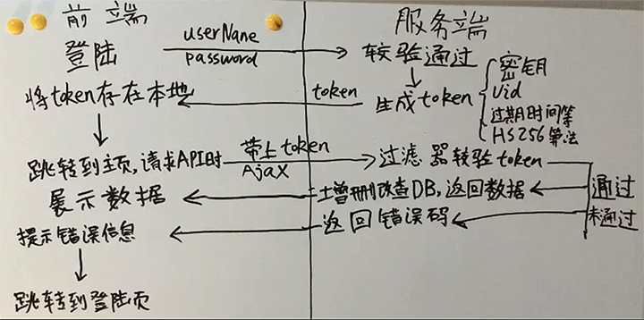

# Token授权设计

## Token 流程



* 1.登录时候,客户端通过用户名与密码请求登录
* 2.服务端收到请求区验证用户名与密码
* 3.验证通过,服务端会签发一个 Token,再把这个 Token 发给客户端.
* 4.客户端收到 Token,存储到本地,如 Cookie,SessionStorage,LocalStorage.我们是存在 SessionStorage
* 5.客户端每次像服务器请求 API 接口时候,都要带上 Token.
* 6.服务端收到请求,验证 Token,如果通过就返回数据,否则提示报错信息.

## Token 应该被保存起来,放到 local / session stograge 或者 cookies

* 1.在单页应用程序中，有些用户刷新浏览器后会带来一些跟 token 相关的问题。而解决方法很简单：你应该把 token 保存到起来：放到 session storage, local storage 或者是客户端的 cookie 里。而浏览器不支持 session storage 时都应该转存到 Cookies 里。
* 2.存放在 Cookie 里面,只是把 Cookie 当作一个储存机制，而不是一种验证机制,这个 cookie 不会被 Web 框架用于用户验证，所以没有 XSRF 攻击的危险。

## 拦截器

客户端请在 `http` `request` 拦截器中加入 token

```js
service.interceptors.request.use(
  config => {
    if (store.getters.token) {
      let token = getToken()
      config.headers['X-Token'] = `Authorization: ${token}` // 存在的话,把Token放在请求头中
    }
    return config
  },
  error => {
    // Do something with request error
    console.log(error) // for debug
    Promise.reject(error)
  }
)
```

## Cookie 的有效期操作

* 1.cookies 可以在浏览器关闭后删除（session cookies）；
* 2.通过绝对有效期或弹性有效期（sliding window expiration）；
* 3.Cookies 可以通过携带有有效期地保存起来。

## 一旦 token 过期，只需要重新获取一个。我们一般定义个可以接口去刷新 token

* 1.让旧的 token 失效；
* 2.检查这个用户是不是还存在，权限是否被取消或者任何对你的程序来说是有必要的；
* 3.得到一个更新了有效期的 token。
